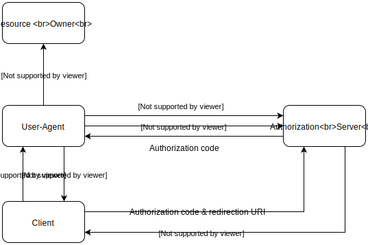

# Authorization Code Grant

The Authorization Code Grant is one of the most commonly used OAuth 2.0 flows, 
designed for server-side applications that can securely store client credentials. 
In this flow, instead of directly providing access tokens to the client application, 
the authorization server first issues a temporary authorization code.
This code is then exchanged for an access token in a secure server-to-server communication.

This grant type is ideal for web applications with both frontend and backend components, 
where the backend can securely store client credentials and handle the token exchange.
It provides better security compared to implicit flow since access tokens are never exposed to the browser or end-user.



The Authorization Code flow begins when a client application redirects the user to the authorization server's endpoint.
After the user authenticates and grants permission, the authorization server redirects 
them back to the client application with a temporary authorization code. This code is short-lived and can only be used once.

The client application then makes a secure server-to-server request to exchange this authorization code for an access token.
During this exchange, the client must authenticate itself using its client ID and secret.
This two-step process ensures that access tokens are never exposed to the user's browser and provides 
an additional layer of security compared to other OAuth flows.


:::info
For applications that are able to securely store a secret it is recommended to supply 
the secret in the token request due to security considerations. Otherwise, if the application is unable to securely store a secret (i.e. a frontend-only app), we suggest using PKCE. Both methods are supported by Aidbox.
:::

:::note
The easiest way to test the Authorization Code Grant flow is 
through the [Aidbox Sandbox UI](https://docs.aidbox.app/modules/security-and-access-control/auth#auth-sandbox)
(IAM -> Sandbox -> Authorization Code).
:::

## 1. Configure Client

The first step is to configure Client (Application) for Authorization Grant with secret and redirect_uri, as well as code grant type:

```yaml
PUT /Client/webapp
Accept: text/yaml
Content-Type: text/yaml

secret: verysecret
first_party: true
grant_types:
  - code
auth:
  authorization_code:
    redirect_uri: 'http://myapp.app'
    access_token_expiration: 360 # 6 minutes
    token_format: jwt
    secret_required: true
    refresh_token: true
    refresh_token_expiration: 86400 # 24 hours
```

Client will act on behalf of the user, which means Access Policies should be
configured for User, not for Client.

You can configure Client for JWT tokens, set token expiration and enable a refresh token:

| Parameter | Type | Description |
| --- | --- | --- |
| **secret** | string | Client secret |
| **first_party** | boolean | Client is first party |
| **grant_types** | strings[] | Grant types supported by the client (`code`) |
| **auth.authorization_code** | object | Authorization code grant configuration |
| **.redirect_uri** | string | Redirect URI |
| **.access_token_expiration** | int | Access token expiration time in seconds from issued at |
| **.token_format** | string | Use access token in JWT format |
| **.secret_required** | boolean | Require secret for token |
| **.refresh_token** | boolean | Enable refresh token |
| **.refresh_token_expiration** | int | Refresh token expiration time in seconds from issued at or last usage. If not present, token will be expireless |
