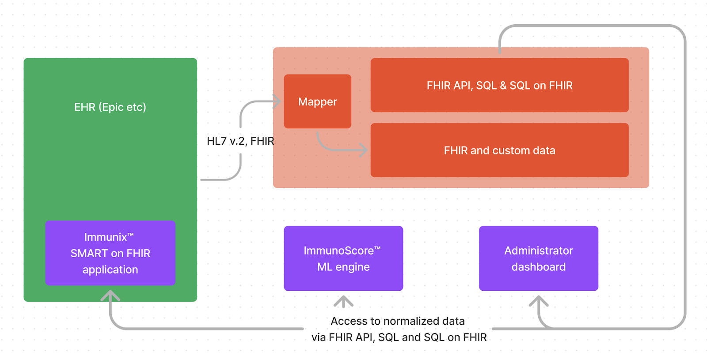
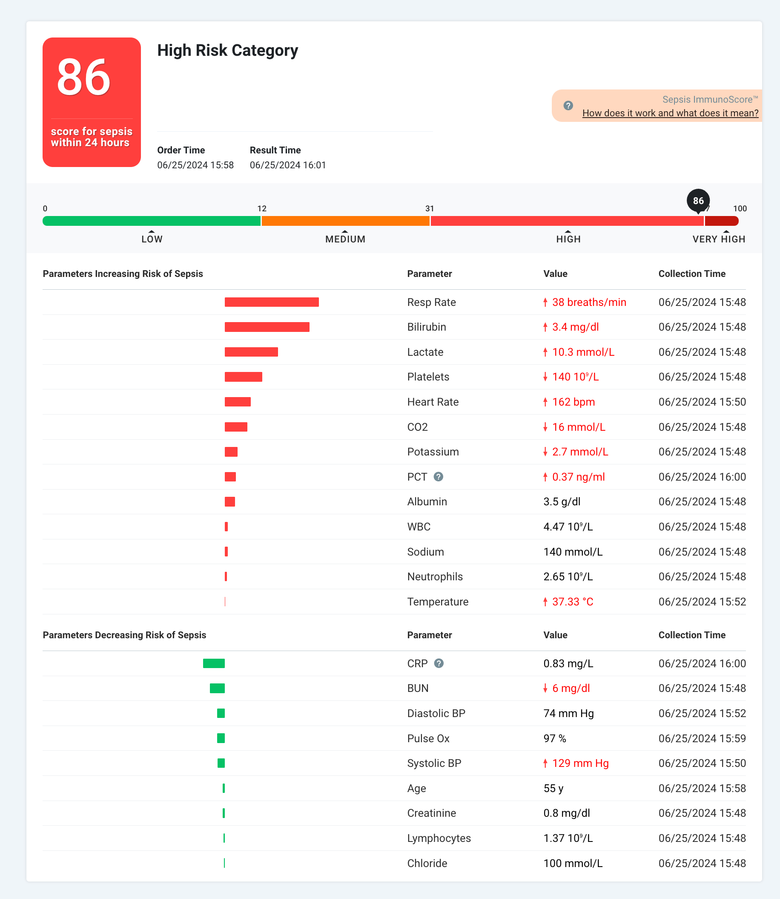

# Immunix by Prenosis

Aidbox FHIR Platform for the development of ImmunixTM for precision medicine
Discover how Prenosis developed the first FDA-marketing authorized AI diagnostics tool for sepsis using the Aidbox FHIR backend, resulting in a faster, future-proof, and more scalable solution.

## Introduction

Sepsis is a life-threatening condition characterized by an overactive immune response to infection. The WHO estimates that it accounts for 1 in 5 deaths worldwide. In the United States alone, sepsis treatment costs nearly $27 billion annually, making it one of the largest cost drivers for U.S. hospitals.

Sepsis is difficult for providers to detect due to the varied presentation in patients. However, new technologies can enhance early prediction. Machine learning (ML) models are particularly effective when rapid assessment of multiple parameters is required. Prenosis developed an AI/ML based Software as a Medical Device for the diagnosis and prediction of sepsis that analyzes over 20 biological parameters.

## Product Description

Prenosis Inc. is an artificial intelligence company enabling precision medicine in acute care. Prenosis spent nearly a decade building a biological and clinical dataset, which is recognized as the largest ever generated for acute patients suspected of serious infection. Leveraging this comprehensive dataset, Prenosis developed the Sepsis ImmunoScore™ - the first FDA-authorized AI/ML tool for sepsis risk diagnosis and prediction. It integrates with existing EHR systems and provides ML-based insights to help providers diagnose sepsis faster and initiate treatment sooner. The Sepsis ImmunoScore™ is launched via the Immunix™ platform.

## Challenge

In 2022, Prenosis completed its R&D stage and faced the challenge of developing an AI/ML product that would meet FDA requirements and pass SaMD (Software as a Medical Device) certification.
Prenosis needed a backend to aggregate and normalize data from EHRs and medical devices, perform calculations, and deliver results and information back to the EHR to support clinician workflows. FHIR was the natural choice for clinical data normalization, offering the most comprehensive and popular healthcare data model. While most modern EHRs have FHIR capabilities, their APIs are limited and primarily suited for querying specific FHIR resources for individual patients.

Additional limitations include:
* They rarely allow writing data back (effectively read-only).
* They don't support complex queries, such as advanced filtering, aggregations, or calculations, and provide insufficient tools for analytics.
* None of the major EHR systems currently support FHIR subscriptions, and they allow only limited load on their APIs. For real-time updates on EHR data changes, third-party developers must rely on alternative channels, such as HL7 v2 feeds.
• EHR systems' FHIR APIs differ slightly from each other, with variations even between implementations from the same vendor.

These limitations led Prenosis to adopt the Aidbox FHIR platform, which provided:
* A comprehensive FHIR backend with both read and write capabilities.
* Additional APIs, including SQL on FHIR, for advanced data processing.
* An HL7 v2 adapter to receive real-time updates from the EHRs.
* An EHR-independent data store offering a unified data model and APIs for Prenosis applications, while managing differences between EHR implementations.

Aidbox also benefited Prenosis with:
* The ability to handle data that doesn't fit FHIR using custom FHIR-like resources, which Aidbox users can define with metadata.
* Robust security features, including HIPAA compliance and high availability, which are crucial for healthcare applications and FDA certification.

## Solution architecture

Aidbox receives information about admissions and transfers to the ICU via an HL7 v2 ADT feed using the Aidbox HL7 v2 to FHIR connector. All necessary clinical information is requested via the FHIR API and stored in Aidbox as FHIR resources. Each hospital has a slightly different configuration, and data normalization is sometimes required before providing information to the Sepsis ImmunoScore™ ML engine. Most observations come with LOINC codes, but in some rare cases, Prenosis maps custom EHR codes to LOINC during the normalization step. Observation values are normalized and converted to specific units of measurement.

In current research studies, to initially identify patients who may develop sepsis, Prenosis focuses on adult patients in the ED with blood culture orders, likely indicating a suspicion of infection. This is done by periodically querying Epic's FHIR API ServiceRequest endpoint.

To properly manage the data polling workflow and track specimen collection, some service data needs to be persisted. Aidbox custom resources are useful for this purpose. Prenosis defined additional custom FHIR-like resources to store service data that doesn't fit the FHIR data model.
‍
Specifically:
* The GatherDataConfiguration custom resource is used to record information about resource type, search parameters, and the period during which data should be polled from Epic.
* LabSampleItem and other custom resources are used to flag remnant plasma samples of interest from patients recruited into the study and the individual processing of each sample to be shipped to Prenosis’ bio-bank.
* Box and BoxSet custom resources are used to track specimen packaging  and delivery.

Clinical data is stored in Aidbox in the FHIR format and complemented with indexes for performance optimization. Sepsis ImmunoScore's custom logic, developed in Python, serves data to the ML Engine. It checks when sufficient data is available to run the ML Engine and then queries it. The ML Engine, developed in R, runs within a Python web framework called Flask. It processes data from the Sepsis ImmunoScore™ backend and sends the prediction back to the FHIR database in just 14 seconds.

The Sepsis ImmunoScore™ is stored in Aidbox, and Prenosis uses a SMART on FHIR practitioner-facing application called Immunix to display the score to clinicians. Sepsis ImmunoScore™ is stored as a Composition FHIR resource that contains Observations.

The Immunix Administrator Dashboard allows for the configuration of Immunix across different hospitals.

## Feedback from the developer

Ilya Beda, the CTO of Beda Software, whose team helped Prenosis develop their applications, provided the following details on the work process and Aidbox's unique features:
"We’ve been working as part of the Prenosis product team, gathering requirements, defining clinical workflows, and prototyping a UX solution. Together, we created a clean and informative UI that is seamlessly embedded into the software providers use daily. A great UX comes with a cost. This interface requires advanced FHIR server capabilities including custom resource definitions and SQL on FHIR. Over the last few years, we've worked with numerous FHIR servers. While they all implement various subsets of the FHIR specification, Aidbox offers non-standard capabilities that allow it to serve as the sole application backend.

Custom Resources allowed us to persist all Prenosis data, including non-FHIR data, in the same database. While the majority of healthcare data was stored as FHIR resources, the application needed to store system configuration and workflow-related information.

This data doesn't map easily to FHIR, and using FHIR profiles would require cluttering resources with unnecessary but required attributes and adding many extensions. In these cases, we prefer to use custom resources. They have clear names, adding clarity to the database structure. These resources are mostly for internal use and aren't intended to be shared with other systems, though all Aidbox APIs are available for them. It's also very convenient to have everything in one place and not duplicate security and disaster recovery components.

While the FHIR API is excellent for interoperability, ML-based applications require more powerful tools for calculations. Aidbox doesn't fall short here, providing SQL API for all data. It also supports the emerging SQL on FHIR specification. Prenosis could be one of the first companies to bring SQL on FHIR to production.Finally, we have implemented a no-code data gathering tool to simplify the EHR integration process and applied an infrastructure-as-code approach to easily scale the solution."

Other Aspects - Compliance, Security, QMS, FDA Clearance
Obtaining FDA clearance requires substantial preparatory work, including meeting requirements for software quality, security, and operation. A significant portion of these regulatory requirements has been met using Aidbox platform features, such as audit logs, authentication, and access controls.
* Audit Logs allowed Prenosis to obtain all logs simply by sending them to the FHIR Platform endpoint, creating only one integration point with Elasticsearch.
* Prenosis utilizes native support for OAuth 2.0 and Azure Active Directory integration within the Aidbox FHIR Platform.  This allows end users within hospital systems to have single sign-on to the Immunix applications. 
* The Aidbox Access Control module enabled Prenosis to develop and implement granular Access Policies.

## Results

Early prediction of sepsis is key to saving lives. Prenosis' ML solution significantly improves upon traditional sepsis detection tools. It supports clinical decision-making and provides a high accuracy of sepsis diagnosis or prediction of sepsis within the next 24 hours, in addition to predicting the risk of deterioration.
‍
Prenosis success:
* Built the MVP of Sepsis ImmunoScore™ within 3 months.
* Successfully ran pilots with three U.S. hospitals.
* Submitted application for FDA SaMD clearance.
* Received FDA clearance.

Aidbox FHIR platform, allowed Prenosis to:
* Reduce development time by approximately 50% by utilizing off-the-shelf configurable APIs and FHIR storage with support for SQL and custom resources.
* Meet regulatory requirements and obtain FDA approval for Sepsis ImmunoScore™.
* Ensure security and HIPAA compliance out of the box.

Sepsis ImmunoScore™ integration outcome:
* Connected with three large hospitals running Epic EHR
* Over 75,000 patients, 200,000 encounters, and 6 million observations have been processed through the Immunix software running on the Aidbox platform.
* Over 5,000 plasma samples have been processed and tracked in the Aidbox database over the past year.
* Nearly 1,200 patients have been recruited into a clinical study and had Sepsis ImmunoScores calculated.